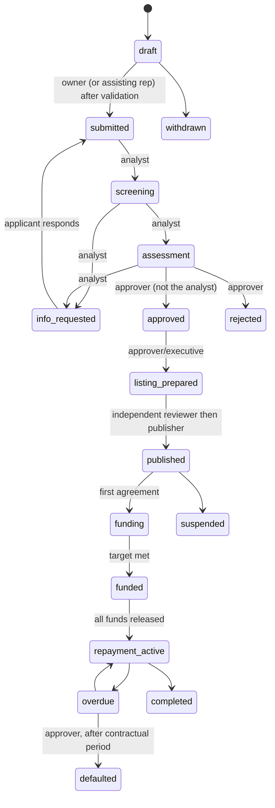
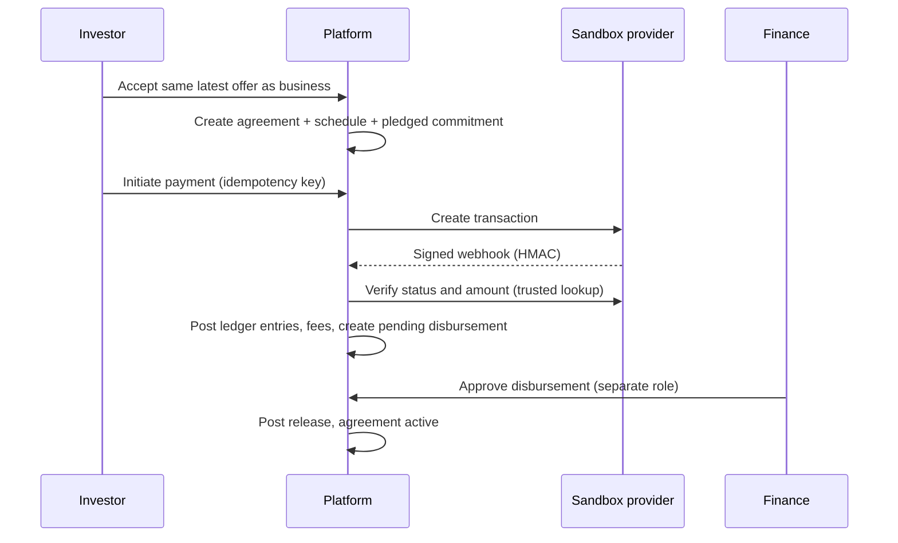

# Workflows

## Application lifecycle

```mermaid
stateDiagram-v2
  [*] --> draft
  draft --> submitted: owner (or assisting rep) after validation
  submitted --> screening: analyst
  screening --> assessment: analyst
  screening --> info_requested: analyst
  assessment --> info_requested: analyst
  info_requested --> submitted: applicant responds
  assessment --> approved: approver (not the analyst)
  assessment --> rejected: approver
  approved --> listing_prepared: approver/executive
  listing_prepared --> published: independent reviewer then publisher
  published --> funding: first agreement
  funding --> funded: target met
  funded --> repayment_active: all funds released
  repayment_active --> overdue
  overdue --> repayment_active
  repayment_active --> completed
  overdue --> defaulted: approver, after contractual period
  draft --> withdrawn
  published --> suspended
```

## Money path (all simulated)

```mermaid
sequenceDiagram
  participant I as Investor
  participant P as Platform
  participant S as Sandbox provider
  participant F as Finance
  I->>P: Accept same latest offer as business
  P->>P: Create agreement + schedule + pledged commitment
  I->>P: Initiate payment (idempotency key)
  P->>S: Create transaction
  S-->>P: Signed webhook (HMAC)
  P->>S: Verify status and amount (trusted lookup)
  P->>P: Post ledger entries, fees, create pending disbursement
  F->>P: Approve disbursement (separate role)
  P->>P: Post release, agreement active
```
